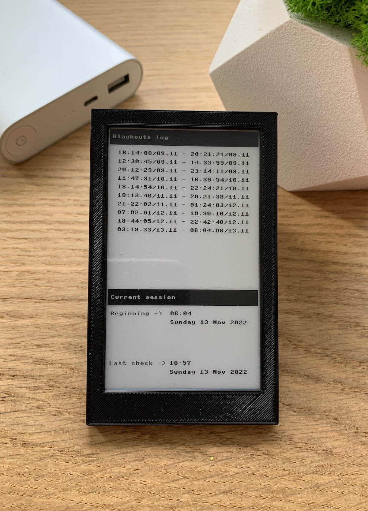

# Blackout Logger

A miniature device that's keeping track of power outages.



### Hardware
* Raspberry Pi Pico
* Precision RTC Module (DS3231)
* Waveshare eink 3.7


### Software
#### MicroPython
The software is written in MicroPython 1.19.1

1. Download the MicroPython UF2.
2. Push and hold the BOOTSEL button and plug your Pico into the USB port of your computer. Release the BOOTSEL button after your Pico is connected.
3. It will mount as a Mass Storage Device called RPI-RP2.
4. Drag and drop the MicroPython UF2 file onto the RPI-RP2 volume. 

#### rshell
To upload and configure your Pico Solar System you will need to install rshell. Make sure you have _pip_ installed.
```
pip3 install rshell
```

#### Installing Pico Solar System
1. Download Pico Solar System
```
git clone https://github.com/dr-mod/blackout-logger.git
```
2. Open the directory with the source code
```
cd blackout-logger
```
3. Copy required python files to your pico
```
rshell
cp *.py /pyboard/
```
4. Set time & configure the RTC module 
```
repl

import time
import ds3231
rtc = ds3231.ds3231()
rtc.set_time(time.time())
```
To account for a timezone you might want to apply an offset to the UTC timestamp in seconds:
```
rtc.set_time(time.time() + 60 * 60 * (+ OFFSET_IN_HOURS) )
```

### Support the project
If you would like to support what I do and keep me caffeinated, you can do it here:

[](https://www.buymeacoffee.com/drmod)
